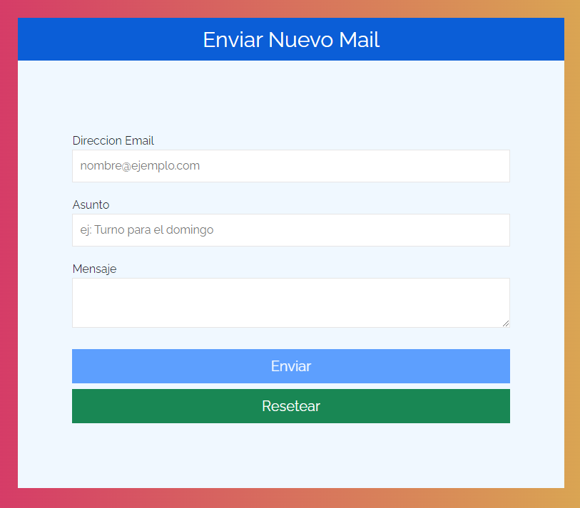

# Simulación de envio de mails

Segundo proyecto realizado de <a href="https://www.udemy.com/course/javascript-moderno-guia-definitiva-construye-10-proyectos/">curso de udemy</a> con el aprendizaje de videos previos.

> *Consta de 3 inputs de los cuales dos son de texto y uno para el email, y dos buttons, uno para enviar el email y otro para resetear el formulario.
Si el email no tiene "@" y no tiene dominio se marcara de rojo la casilla y el boton de enviar no se activa, lo mismo en el caso del asunto y el mensaje, solo que sin la validacion del arroba y el dominio*
- Una vez validado todo se libera el boton enviar y se puede simular el envio del mail .
- <a href="https://sonnyrmt.github.io/formulary/">Ingresar al formulario</a>

